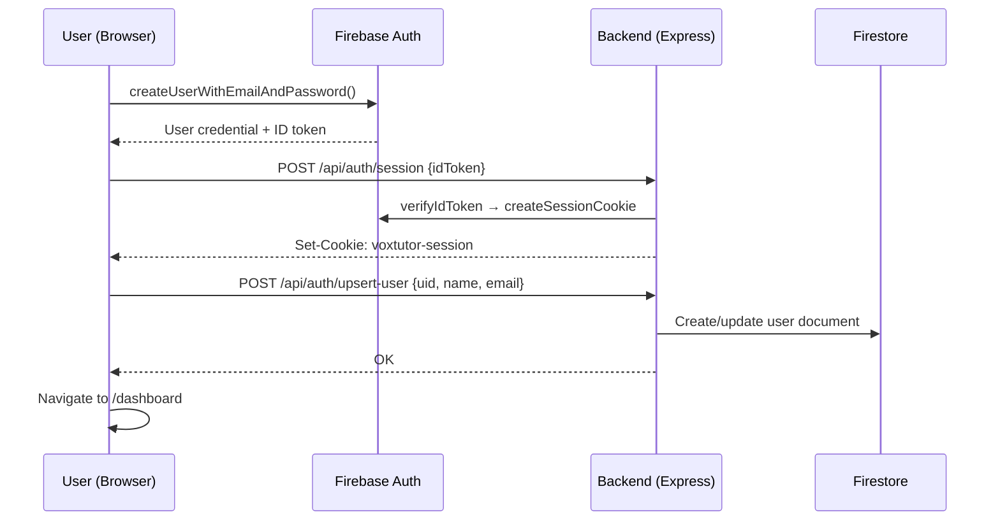
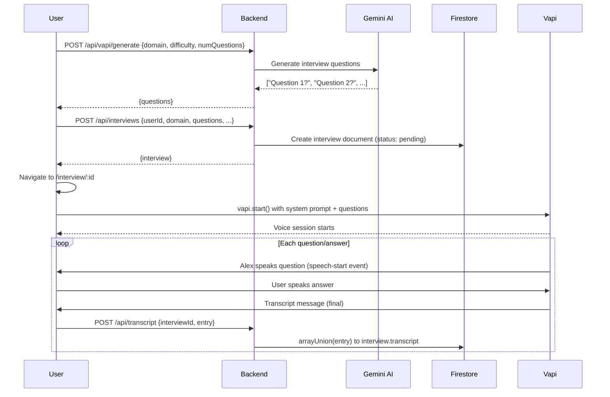
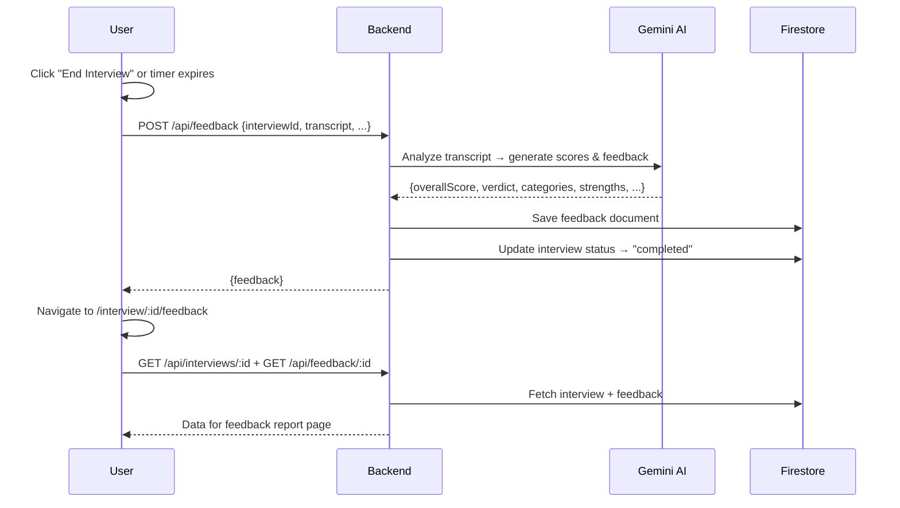

# VoxTutor — Code Explanation, Workflow & Functionality

## What is VoxTutor?

VoxTutor is an **AI-powered mock interview platform** that conducts **real-time voice interviews**. Users pick a domain (e.g., Software Engineering, Finance), set their experience level, and a voice AI agent named "Alex" interviews them with adaptive questions. After the interview, an AI generates a detailed feedback report with scores, strengths, and improvement areas.

---

## Core Functionality

### 1. 🔐 Authentication (Sign Up / Sign In)
- Users can create an account using **email/password** or **Google Sign-In**
- Firebase Authentication handles the identity verification
- On successful sign-in, a **session cookie** (7-day expiry, HTTP-only) is created server-side
- The session cookie is used for all subsequent API requests — no token management on the frontend

### 2. 📊 Dashboard
- Shows the user's **interview history** (most recent first, up to 20)
- Displays **stats**: total sessions, completed count, average score, domains practiced
- Each interview card shows domain, difficulty, status, score (if completed), and verdict
- The "New Interview" button opens a **2-step modal wizard**

### 3. 🎙️ New Interview Creation (2-step wizard)
- **Step 1**: Choose a domain (Software Engineering, Finance, Marketing, Product, Data Science, Consulting)
- **Step 2**: Set experience level (Entry/Mid/Senior) and duration (10/20/30 min → 3/5/7 questions)
- On "Start Interview":
  1. Frontend calls `POST /api/vapi/generate` → Gemini AI generates interview questions
  2. Frontend calls `POST /api/interviews` → Interview document created in Firestore
  3. User is navigated to the interview room

### 4. 🗣️ Live Voice Interview
- Uses **Vapi** (Voice API) to create a real-time voice session
- An AI assistant named "Alex" asks questions one by one, listens to answers, and asks follow-ups
- The **live transcript** appears in real-time on the right panel
- Each transcript entry is saved to Firestore atomically via `POST /api/transcript`
- A **countdown timer** tracks remaining time
- The user can **mute/unmute** their microphone
- When all questions are done or the timer runs out, the interview ends automatically

### 5. 📝 Feedback Report
- When the interview ends, the full transcript is sent to `POST /api/feedback`
- **Gemini AI** analyzes the transcript and generates:
  - **Overall score** (0-100)
  - **Verdict** (Strong Hire / Hire / Maybe / No Hire)
  - **Summary** (2-3 sentence assessment)
  - **4 category scores**: Technical Knowledge, Communication Clarity, Problem-Solving, Domain Experience
  - **Strengths** (3 bullet points)
  - **Areas to improve** (3 bullet points)
  - **Next steps** (3 actionable recommendations)
- The feedback is stored in Firestore and displayed with animated score rings and progress bars

---

## Tech Stack

| Layer      | Technology         | Purpose                                      |
|------------|--------------------|----------------------------------------------|
| Frontend   | React 18           | UI components and state management           |
| Bundler    | Vite               | Fast dev server and production builds         |
| Routing    | React Router v6    | Client-side page navigation                  |
| Styling    | TailwindCSS        | Utility-first CSS with custom design tokens  |
| Icons      | Lucide React       | Consistent icon set                          |
| Voice AI   | Vapi               | Real-time voice interview sessions            |
| AI/LLM     | Google Gemini      | Question generation and feedback analysis     |
| Backend    | Express.js         | REST API server                              |
| Database   | Firebase Firestore | Document database for users, interviews, feedback |
| Auth       | Firebase Auth      | Email/password + Google authentication        |
| Dates      | Day.js             | Relative time formatting ("2 hours ago")      |

---

## Project Structure Explained

```
Vox-Tutor-main/
├── frontend/                          # Everything the user sees
│   ├── src/
│   │   ├── components/                # Reusable UI building blocks
│   │   │   ├── ui/                    # Generic UI (AuthForm, Navbar)
│   │   │   ├── dashboard/             # Dashboard-specific (InterviewCard, NewInterviewButton)
│   │   │   ├── interview/             # Interview session (InterviewPageClient)
│   │   │   └── common/                # Shared (ScoreRing)
│   │   ├── pages/                     # Full page components (one per route)
│   │   ├── layouts/                   # Page wrappers (AuthLayout, RootLayout)
│   │   ├── hooks/                     # Custom React hooks (useAuth)
│   │   ├── services/                  # API communication layer
│   │   ├── config/                    # Firebase client initialization
│   │   └── lib/                       # Constants and shared data
│   └── public/                        # Static assets (favicon, OG image)
│
├── backend/                           # Server-side logic
│   ├── config/                        # Firebase Admin initialization
│   ├── controllers/                   # Business logic (one per feature)
│   ├── middleware/                     # Request processing (auth verification)
│   └── routes/                        # URL → controller mapping
│
├── firestore.rules                    # Database security rules
├── .env.example                       # Environment variable template
└── package.json                       # Root scripts to run both servers
```

---

## Complete Request Workflow

### User Signs Up



### User Starts an Interview



### Interview Ends → Feedback Generated



---

## API Endpoints Reference

### Authentication

| Method | Endpoint               | Description                     | Auth Required |
|--------|------------------------|---------------------------------|:---:|
| POST   | `/api/auth/session`    | Create session cookie from Firebase ID token | No |
| POST   | `/api/auth/revoke`     | Clear session cookie (logout)   | No |
| GET    | `/api/auth/me`         | Get current user from session   | No* |
| POST   | `/api/auth/upsert-user`| Create or update user profile   | No |

*Returns `{user: null}` if not authenticated

### Interviews

| Method | Endpoint               | Description                         | Auth Required |
|--------|------------------------|-------------------------------------|:---:|
| POST   | `/api/interviews`      | Create a new interview              | No |
| GET    | `/api/interviews`      | Get current user's interviews       | ✅ |
| GET    | `/api/interviews/:id`  | Get a single interview by ID        | No |

### Feedback

| Method | Endpoint                    | Description                          | Auth Required |
|--------|-----------------------------|--------------------------------------|:---:|
| POST   | `/api/feedback`             | Generate AI feedback and save        | No |
| GET    | `/api/feedback/user`        | Get current user's all feedbacks     | ✅ |
| GET    | `/api/feedback/:interviewId`| Get feedback for specific interview  | No |

### Other

| Method | Endpoint              | Description                          | Auth Required |
|--------|-----------------------|--------------------------------------|:---:|
| POST   | `/api/transcript`     | Append transcript entry to interview | No |
| POST   | `/api/vapi/generate`  | Generate interview questions via Gemini | No |
| GET    | `/api/health`         | Server health check                  | No |

---

## Database Schema (Firestore Collections)

### `users` collection
```
{
  uid: "firebase-uid",
  name: "John Doe",
  email: "john@example.com",
  photoURL: "https://...",        // from Google sign-in, empty for email users
  createdAt: "2025-01-15T..."
}
```

### `interviews` collection
```
{
  id: "auto-generated-id",
  userId: "firebase-uid",
  domain: "software",             // domain ID
  domainLabel: "Software Engineering",
  domainIcon: "💻",
  difficulty: "mid",              // entry | mid | senior
  duration: 20,                   // minutes
  status: "pending",              // pending → active → completed
  questions: ["Q1?", "Q2?", ...],
  transcript: [
    { role: "interviewer", content: "Tell me about...", timestamp: "..." },
    { role: "user", content: "I would approach...", timestamp: "..." }
  ],
  createdAt: "2025-01-15T...",
  completedAt: "2025-01-15T..."   // set when interview ends
}
```

### `feedback` collection
```
{
  id: "auto-generated-id",
  interviewId: "interview-id",
  userId: "firebase-uid",
  overallScore: 72,               // 0–100
  verdict: "Hire",                // Strong Hire | Hire | Maybe | No Hire
  summary: "The candidate demonstrated...",
  categories: [
    { name: "Technical Knowledge", score: 78, rating: "good", feedback: "..." },
    { name: "Communication Clarity", score: 65, rating: "average", feedback: "..." },
    { name: "Problem-Solving Approach", score: 80, rating: "good", feedback: "..." },
    { name: "Domain Experience", score: 65, rating: "average", feedback: "..." }
  ],
  strengths: ["Clear communication", "Good examples", "..."],
  improvements: ["More depth on system design", "..."],
  nextSteps: ["Practice designing distributed systems", "..."],
  createdAt: "2025-01-15T..."
}
```

---

## Key Design Decisions

### Why session cookies instead of JWT tokens?
- **Security**: HTTP-only cookies can't be accessed by JavaScript (XSS-safe)
- **Simplicity**: No token refresh logic needed, cookie auto-sent on every request
- **Firebase native**: Firebase Admin SDK has built-in `createSessionCookie()` / `verifySessionCookie()`

### Why Vite instead of Next.js?
- The user explicitly requested a **React + Express** split architecture
- Vite provides **instant HMR** (Hot Module Replacement) during development
- The `proxy` config in Vite seamlessly forwards `/api/*` requests to Express

### Why client-side fetching instead of SSR?
- In a React SPA (Single Page Application), data fetching happens in `useEffect` hooks
- This means the first load shows a brief loading state, but after that navigation is instant
- The tradeoff: slightly slower first paint vs. simpler architecture and clear separation of concerns

### Why Gemini for both questions and feedback?
- Single API key, single billing account
- Gemini is fast enough for real-time question generation
- The `responseMimeType: 'application/json'` config ensures structured JSON output for feedback
